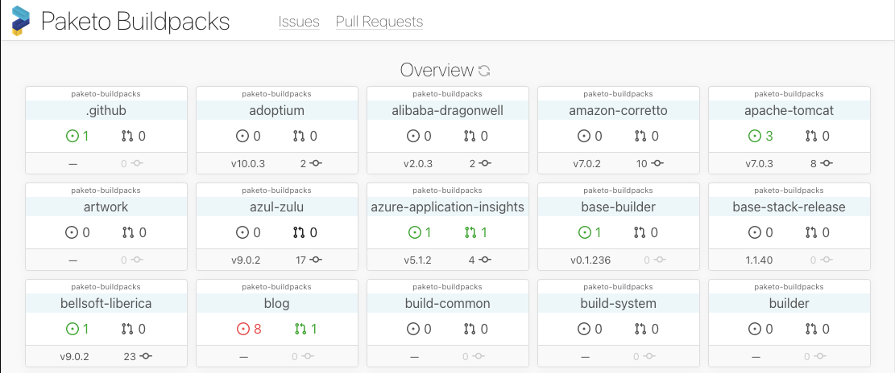

# [Paketo Dashboard](https://dashboard.paketo.io)

The Paketo Dashboard provides an overview of the project allowing the core
development team to track open issues, pull requests, and releases.



## Deployment

The dashboard is deployed using the [`.github/workflows/deploy.yml`
workflow](./.github/workflows/deploy.yml). This workflow packages the dashboard
using buildpacks and then deploys the resulting image onto Google Cloud Run.

## Development

You can build and run the app by executing the following:

```
GITHUB_CLIENT_ID=<your-client-id> \
GITHUB_CLIENT_SECRET=<your-client-secret> \
REDIRECT_URI=http://localhost:8080/oauth/callback \
./scripts/run.sh
```

For details on getting a client for GitHub API access, check out [this
documentation](https://docs.github.com/en/developers/apps/building-oauth-apps/creating-an-oauth-app).

### Architecture

The application is split into two main parts, a [backend server](./server) that is
responsible for handing the OAuth workflow and serving static assets, and the
[frontend](./web) that is a React app that interacts with the GitHub API to
gather and display aggregate details about the project.

When you build the application, you will notice that the output is a single
binary. This is because the static assets for the app are
[embedded](https://pkg.go.dev/embed) into the Go binary at compilation time.

### Frontend development

The frontend can be run decoupled from the backend server for a faster local
development cycle. To do this, you will need to run the following:

```
cd web
REACT_APP_GITHUB_TOKEN=<your-github-token> yarn start
```

For details on creating a token for GitHub API access, check out [this
documentation](https://docs.github.com/en/authentication/keeping-your-account-and-data-secure/creating-a-personal-access-token).

## Testing

You can run the tests for the backend with the following command:

```
go test ./server
```

For the frontend, run the following:

```
cd web
yarn test
```

### Flow

The frontend codebase uses [Flow](https://flow.org/) for static type checking.
To run the checker, execute the following:

```
cd web
yarn run flow
```
